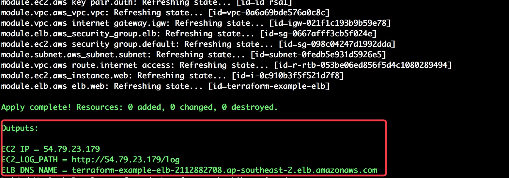
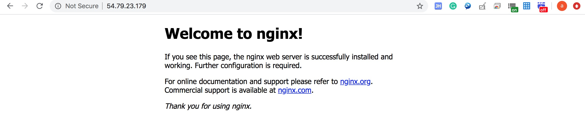
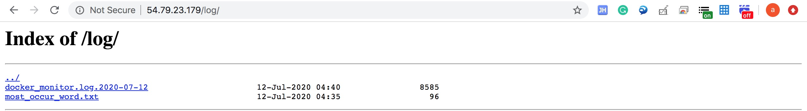
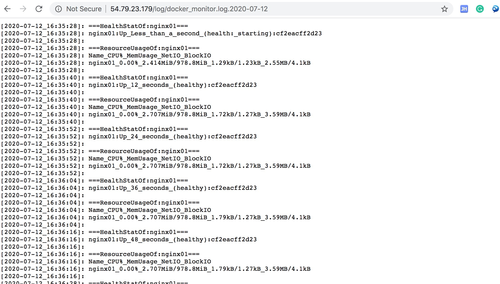
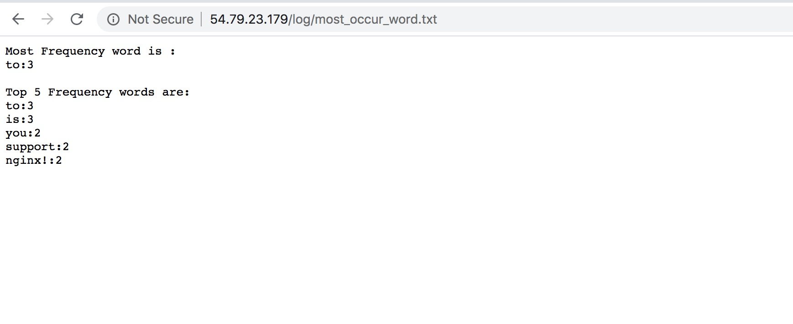
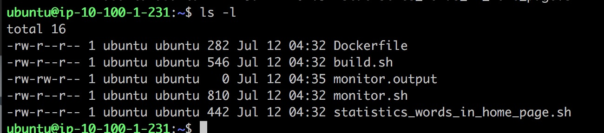

# Terraform Docker NGINX
This is a framework for [Docker](https://www.docker.com/) is working in [Amazon AWS](https://aws.amazon.com/) cloud environment 

This code uses terraform 0.12
 [Terraform](https://www.terraform.io/). 

## Directory Description
### modules: This store aws components which this framwork need by terraform codes. 
### util: Dockerfile and all script in this project, below is the detail.
- build.sh: buiding VM's envrionment, installing docker and running container.
- Dockerfile: For customize docker image
- monitor.sh: Monitoring docker container's states and resource usage
- static_words_in_home_page.sh: A simple script which can count most frequency words in the home page.

## Step One: Prerequisites
Create a file name xxx.tfvars, For example:
auto-demo.tfvars

```
# aws-demo.tfvars
environment = "dev"
region = "ap-southeast-2"
vpc_cidr = "10.100.0.0/16"
public_subnet_cidrs = "10.100.1.0/24"
instance_type = "t2.micro"

private_key_path ="~/interview/id_rsa"
public_key_path= "~/interview/id_rsa.pub"
key_name= "id_rsa"

```

```bash
$ terraform init
$ terraform validate -var-file=aws-demo.tfvars
$ terraform plan -var-file=aws-demo.tfvars
$ terraform apply -var-file=aws-demo.tfvars
```


## Step Two: Check Running Result
After terraform apply running successfully, in the output you will see: EC2_IP and ELB_DNS_NAME (in this framework, it used ELB, but ELB need 1 to 2 minutes to start up after terraform run over. So we should better try EC2_IP first). 

Then Put EC2_IP or ELB_DNS_NAME into Internet Browser, you should see the Nginx Welcome Page:



##  Step Tree: The Script Output
As mentioned above, there are two functional scripts in 'util' dir. These two script would run automatically after docker environment had been built. You can check them through nginx's web service by EC2_LOG_PATH or ELB_LOG_PATH which outputed after terraform apply run over. Log page like this:


Click the monitor log it would show:


Words statistics script run like:


##  Step Tree: Trouble Shooting
Login to VM:
Check docker running status:
```
ubuntu@ip-10-100-1-231:~$ sudo -i
```
```
root@ip-10-100-1-231:~# docker ps
CONTAINER ID        IMAGE                COMMAND                  CREATED             STATUS                    PORTS                NAMES
cf2eacff2d23        nginx:my_version01   "/docker-entrypoint.…"   12 minutes ago      Up 12 minutes (healthy)   0.0.0.0:80->80/tcp   nginx01
```
Check if all files were uploaded to VM:


Check monitor output error log:

```
ubuntu@ip-10-100-1-231:~$ cat monitor.output
```

